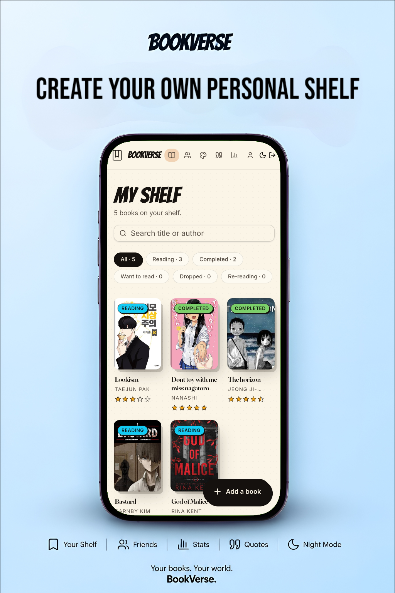
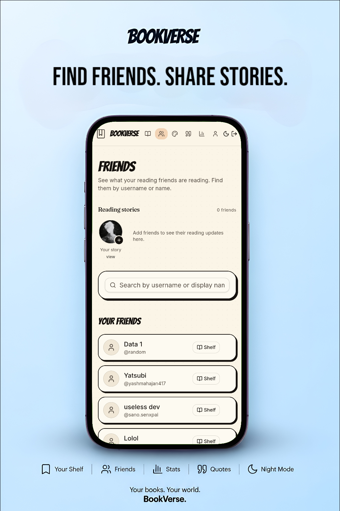
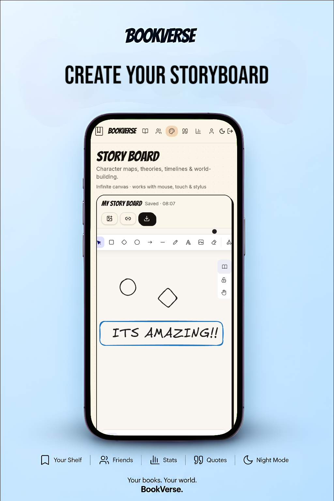
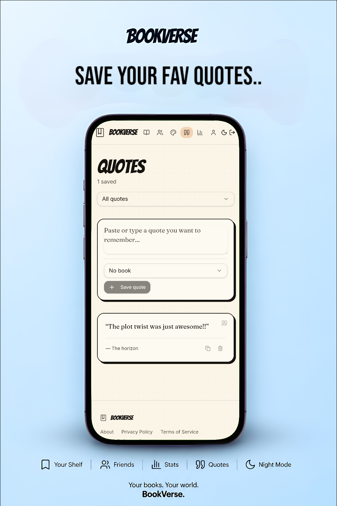
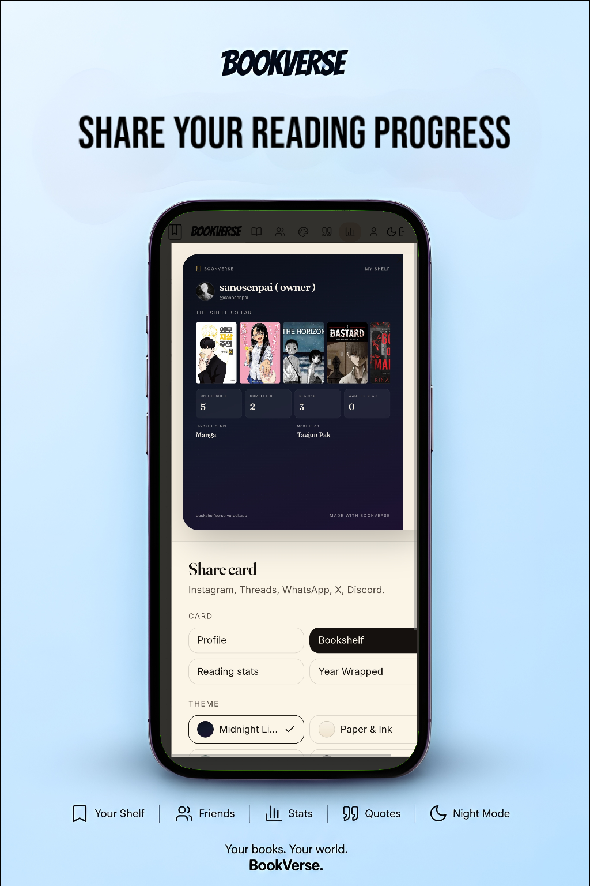
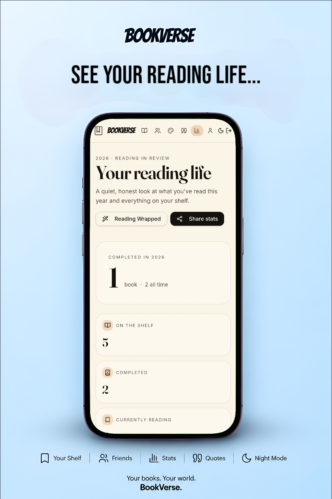

# 

<h1 align="center">BookVerse</h1>

A modern social platform for readers to build their personal library, discover books, share reading progress, connect with friends, collect quotes, write notes, and celebrate every book they finish.

  
  
  
  
  

---

## Preview

<table>
<tr>
<td>

</td>
<td>

</td>
<td>

</td>
<td>

</td>
<td>

</td>
<td>

</td>
</tr>
</table>

## Features

### Personal Library
- Build your digital bookshelf
- Track reading status
- Book ratings
- Reading progress
- Beautiful book cards

### Social Reading
- Add friends
- Visit public profiles
- Explore friends' bookshelves
- Reading stories
- Share reading updates

### Quotes & Notes
- Save favorite quotes
- Personal notebook
- Drawing canvas
- Organize reading thoughts

### Reading Insights
- Reading statistics
- Yearly Wrapped
- Reading streaks
- Activity insights

### Sharing
- Beautiful share cards
- Story sharing
- Reading update cards
- Social-ready designs

### User Experience
- Responsive UI
- Fast loading
- Progressive Web App
- SEO optimized
- Clean animations
- Modern interface

---

## Tech Stack

| Frontend | Backend | Styling | Build |
|-----------|----------|----------|-------|
| React | Supabase | Tailwind CSS | Vite |
| TypeScript | PostgreSQL | shadcn/ui | Bun / npm |

## License

This project is licensed under the MIT License.

---

## Connect

  
  &nbsp;&nbsp;&nbsp;&nbsp;
  
  &nbsp;&nbsp;&nbsp;&nbsp;
  

  <a href="https://github.com/mikey177013">GitHub</a> •
  <a href="https://www.instagram.com/bookverseshelf">Instagram</a> •
  <a href="https://www.reddit.com/r/bookverseshelf/s/Gv05RtrfX4">Reddit</a>

